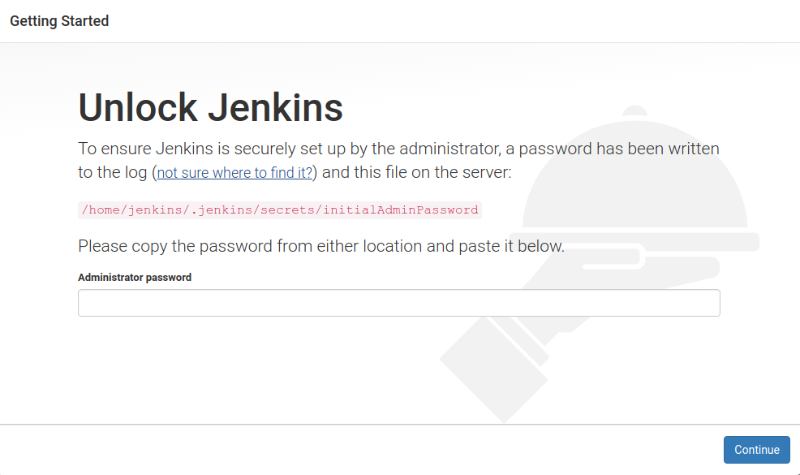

# spring-installer-example
script to install jenkins and the spring-boot-hello-world server

## setup
### clone the project
```bash
git clone https://github.com/bob-crutchley/spring-installer-example
cd spring-installer-example
```

### run the install scripts
this will install jenkins and the spring service

### follow the jenkins setup
jenkins can be accessed from port `8080`, follow the guided setup of jenkins, selecting the default options



